# MedAssistAI — Документация по архитектуре

## Обзор

MedAssistAI — система поддержки клинических решений на основе ИИ, построенная на архитектуре ReAct-агента (Reasoning + Acting). Система использует LangGraph для оркестрации агента, LangChain для абстракций LLM/инструментов, Streamlit для веб-интерфейса и PostgreSQL для хранения данных.

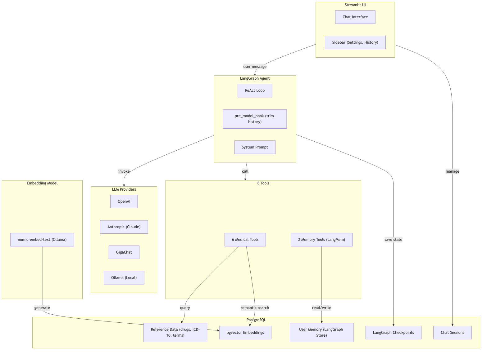

---

## Жизненный цикл запроса

Полный путь сообщения пользователя от ввода до отображения ответа:

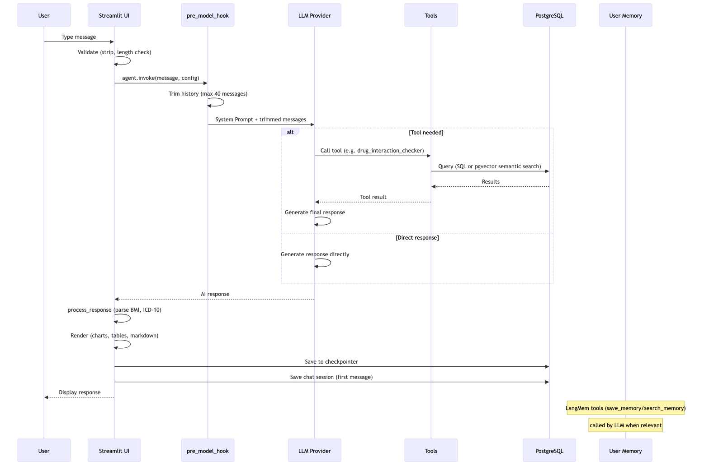

---

## Слоистая архитектура

Приложение следует чистой слоистой архитектуре:

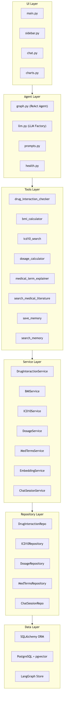

**Поток данных:** `Tool → Service → Repository → Entity → PostgreSQL`

---

## Архитектура памяти

Система использует три вида памяти:

- **Краткосрочная (Short-term)** — `st.session_state.messages`, живёт пока открыта вкладка браузера
- **Долгосрочная (Long-term)** — LangGraph Checkpointer (состояние диалога), LangGraph Store (факты о пациенте), таблица chat_sessions (метаданные)
- **Семантическая (Semantic)** — pgvector embeddings для поиска по смыслу в мед. терминах, МКБ-10, взаимодействиях лекарств

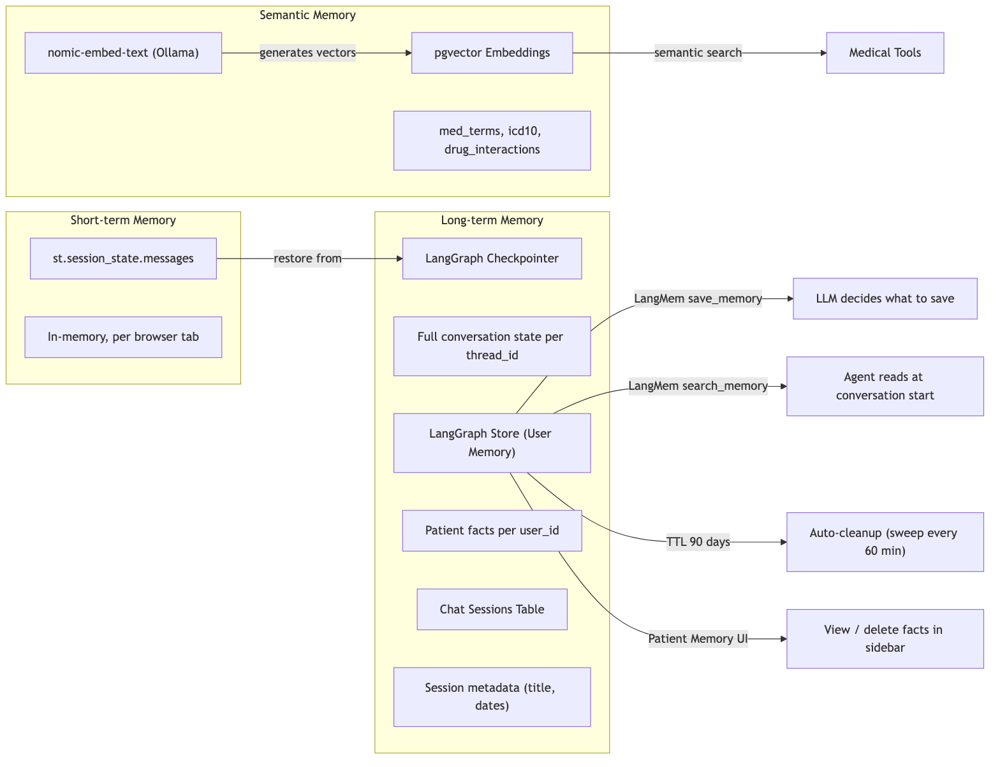

Особенности:
- **LangMem** — tools `save_memory` / `search_memory` для сохранения и поиска фактов о пациенте (semantic search через pgvector + nomic-embed-text)
- **Memory Extractor** — fallback-механизм для провайдеров, которые не вызывают `save_memory` через tool calling (например, GigaChat). После ответа агента выполняется отдельный LLM-вызов для извлечения личных медицинских фактов из сообщения пользователя. Если агент уже вызвал `save_memory` — extractor пропускается
- **TTL 90 дней** — устаревшие факты автоматически удаляются (sweep каждые 60 мин)
- **Patient Memory UI** — пользователь видит и может удалить сохранённые факты в sidebar
- **User ID** — изоляция памяти по пользователям через browser cookie (365 дней)

---

## Конвейер инструментов

Агент имеет доступ к 8 инструментам:

| # | Инструмент | Параметры | Описание |
|---|-----------|-----------|----------|
| 1 | `drug_interaction_checker` | drug_a, drug_b | Проверка взаимодействий лекарств |
| 2 | `bmi_calculator` | weight_kg, height_cm | Расчёт ИМТ + классификация ВОЗ |
| 3 | `icd10_search` | query | Семантический поиск кодов МКБ-10 |
| 4 | `dosage_calculator` | medication, weight_kg, age_years | Расчёт дозировки по весу/возрасту |
| 5 | `medical_term_explainer` | term | Семантический поиск мед. терминов |
| 6 | `search_medical_literature` | query | Веб-поиск (DuckDuckGo) |
| 7 | `save_memory` | content | Сохранение фактов о пациенте (LangMem) |
| 8 | `search_memory` | query | Поиск сохранённых фактов (LangMem) |

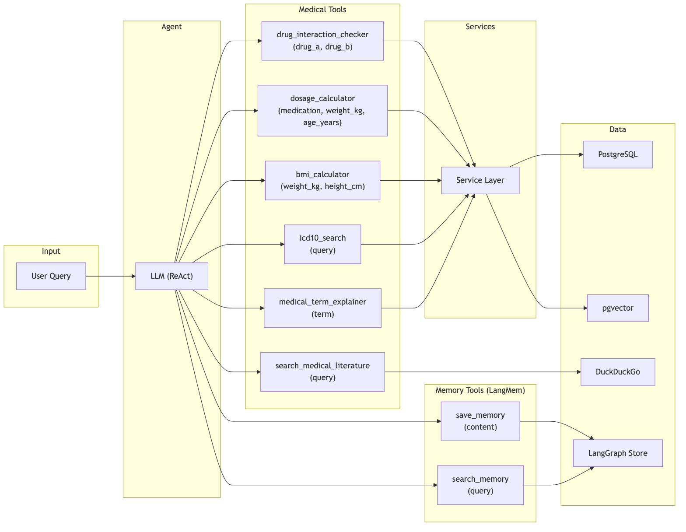

Каждый медицинский инструмент проходит цепочку: `@tool → Service → Repository → PostgreSQL/pgvector`

---

## Архитектура LLM-провайдеров

Поддерживаются 4 провайдера, переключаемых через UI:

| Провайдер | Модели | Подключение |
|-----------|--------|------------|
| **OpenAI** | gpt-5.4-mini, gpt-5.4, gpt-5.2 | API-ключ |
| **Anthropic** | claude-haiku-4-5, claude-sonnet-4-6, claude-opus-4-6 | API-ключ |
| **GigaChat** | GigaChat-2, GigaChat-2-Pro, GigaChat-2-Max | Client ID + Secret |
| **Ollama** | llama3.1, qwen3, phi4, gemma2 | Локально (Docker) |

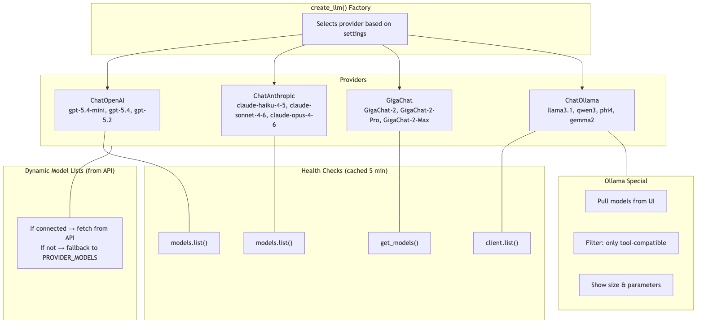

Особенности:
- Списки моделей подтягиваются динамически из API провайдера
- Health check каждого провайдера (кэш 5 мин) с индикацией в UI (✅ / ⬜ / ❌)
- Ollama: скачивание моделей из UI, фильтрация несовместимых (без tool calling)
- Embedding модель (`nomic-embed-text`) — отдельная, фиксированная, через Ollama

---

## Схема базы данных

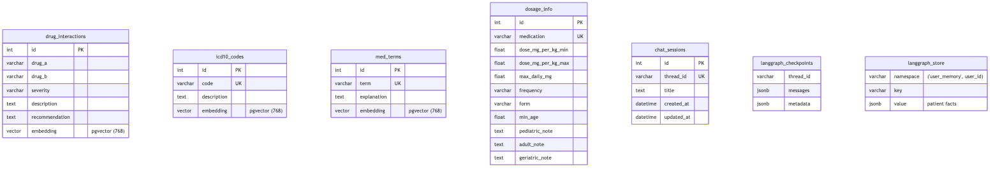

**Основные таблицы:**
- `drug_interactions` — справочник взаимодействий лекарств (43 записи)
- `icd10_codes` — коды МКБ-10 (157 записей)
- `med_terms` — медицинские термины (54 записи)
- `dosage_info` — дозировки лекарств (11 записей)
- `chat_sessions` — метаданные чатов (title, thread_id, даты)

**pgvector:** колонки `embedding vector(768)` в drug_interactions, icd10_codes, med_terms для семантического поиска

**LangGraph:** таблицы checkpoints (состояние агента) и store (факты о пациентах)

---

## Паттерн ReAct-агента

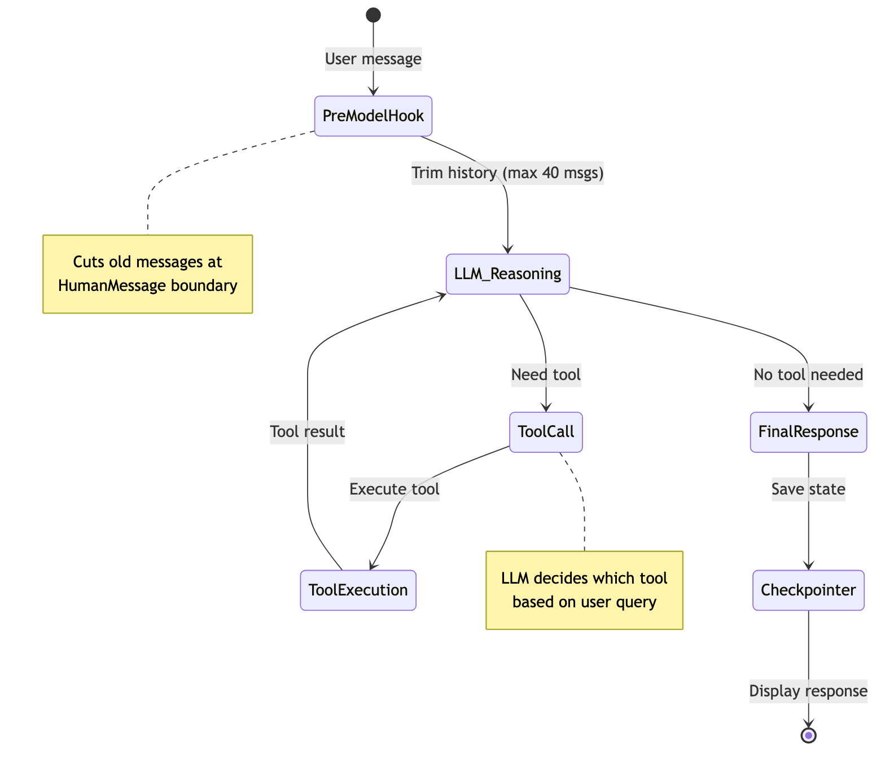

Цикл работы агента:
1. **pre_model_hook** — trim_messages по token budget (32K tokens, защита от переполнения контекста)
2. **LLM Reasoning** — модель решает нужен ли tool call
3. **Tool Execution** — если да, выполняется инструмент
4. **LLM Response** — модель формирует финальный ответ на основе результата
5. **Checkpointer** — сохранение состояния в PostgreSQL

---

## Docker Compose

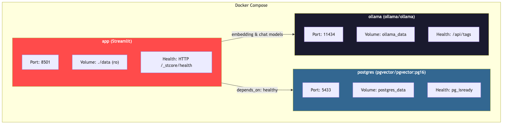

4 сервиса:
- **postgres** (pgvector/pgvector:pg16) — БД, порт 5433
- **ollama** (ollama/ollama) — локальные модели, порт 11434
- **ollama-init** — init-контейнер, скачивает embedding-модель при первом запуске
- **app** (Streamlit) — приложение, порт 8501

Порядок запуска: postgres (healthcheck) + ollama (healthcheck) → ollama-init (pull model) → app

---

## Безопасность

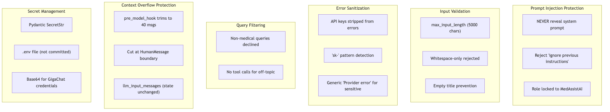

| Мера | Описание |
|------|----------|
| **Prompt Injection** | Запрет раскрытия промпта, отклонение "ignore previous instructions" |
| **Валидация ввода** | max_input_length (5000), отклонение пустых сообщений |
| **Санитизация ошибок** | API-ключи удаляются из сообщений об ошибках |
| **Фильтрация запросов** | Немедицинские вопросы отклоняются без вызова tools |
| **Защита контекста** | trim_messages по token budget (32K), обрезка на границе HumanMessage |
| **Секреты** | Pydantic SecretStr, .env файл, Base64 для GigaChat |

---

## Наблюдаемость

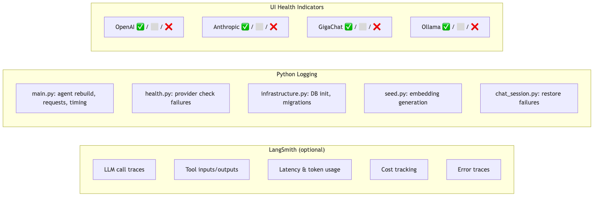

| Компонент | Что покрывает |
|-----------|--------------|
| **LangSmith** (опционально) | Трейсинг LLM-вызовов, latency, tokens, стоимость, tool calls |
| **Python Logging** | Инфраструктура (БД, миграции), health checks, timing запросов, ошибки |
| **UI индикаторы** | Статус подключения каждого провайдера в sidebar |

---

## Справочник конфигурации

Все настройки задаются через переменные окружения (файл `.env`):

| Категория | Переменная | По умолчанию | Описание |
|-----------|-----------|-------------|----------|
| **TLS** | `VERIFY_SSL` | `true` | Проверка TLS-сертификатов для всех внешних сервисов (отключить за корп. прокси) |
| **LLM** | `DEFAULT_LLM_PROVIDER` | `openai` | Провайдер по умолчанию |
| **OpenAI** | `OPENAI_API_KEY` | — | API-ключ |
| **Anthropic** | `ANTHROPIC_API_KEY` | — | API-ключ |
| **GigaChat** | `GIGACHAT_CLIENT_ID` | — | OAuth Client ID |
| | `GIGACHAT_CLIENT_SECRET` | — | OAuth Client Secret |
| **Ollama** | `OLLAMA_BASE_URL` | `http://ollama:11434` | URL сервера |
| **Embeddings** | `EMBEDDING_MODEL` | `nomic-embed-text` | Модель для эмбеддингов |
| | `EMBEDDING_DIM` | `768` | Размерность вектора |
| **Health** | `HEALTH_CHECK_TIMEOUT` | `5` | Таймаут проверки провайдера (сек) |
| **Пользователь** | `USER_STORAGE_KEY` | `medassist_user_id` | Ключ cookie в браузере |
| | `USER_COOKIE_MAX_AGE_DAYS` | `365` | Срок жизни cookie (дней) |
| **Память** | `MEMORY_TTL_DAYS` | `90` | Срок хранения фактов (0 = бессрочно) |
| | `MEMORY_SWEEP_INTERVAL_MINUTES` | `60` | Интервал очистки устаревших фактов |
| **Лимиты** | `MAX_INPUT_LENGTH` | `5000` | Макс. длина сообщения (символов) |
| | `MAX_CONTEXT_TOKENS` | `32000` | Token budget для контекста LLM |
| | `MAX_VISIBLE_CHATS` | `15` | Кол-во чатов в sidebar |
| **БД** | `DB_HOST` | `localhost` | Хост PostgreSQL |
| | `DB_PORT` | `5432` | Порт PostgreSQL |
| | `DB_POOL_SIZE` | `5` | Размер пула соединений |
| **Логирование** | `LOG_LEVEL` | `INFO` | Уровень логирования |
| **Трейсинг** | `LANGCHAIN_TRACING_V2` | `false` | Включить LangSmith |

---

## Стек технологий

| Компонент | Технология | Назначение |
|-----------|-----------|-----------|
| Агентный фреймворк | LangGraph (ReAct) | Оркестрация агента, машина состояний |
| Абстракция LLM | LangChain | Провайдер-агностичный интерфейс LLM/tools |
| Память пользователя | LangMem + LangGraph Store | Сохранение/поиск фактов о пациенте между сессиями |
| Семантический поиск | pgvector + nomic-embed-text | Векторный поиск по мед. терминам, МКБ-10 |
| Веб-интерфейс | Streamlit | Интерактивный медицинский ассистент |
| База данных | PostgreSQL 16 + pgvector | Справочные данные, сессии, чекпоинты, эмбеддинги |
| ORM | SQLAlchemy 2.0 | Слой доступа к данным |
| Миграции | Alembic | Версионирование схемы БД |
| Визуализация | Plotly | Gauge-диаграмма ИМТ |
| Веб-поиск | DuckDuckGo (ddgs) | Поиск медицинской литературы |
| Наблюдаемость | LangSmith | Трейсинг LLM, latency, токены |
| Контейнеризация | Docker Compose | Многосервисный деплой |
| Локальные LLM | Ollama | Локальный inference + эмбеддинги |
| Качество кода | Ruff + pre-commit | Линтинг и форматирование |
